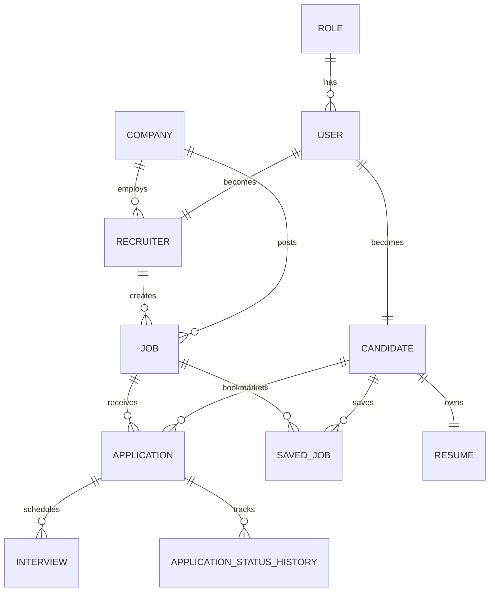

                                +-----------+
                                |   Roles   |
                                +-----------+
                                      |
                                      |
                                      ▼
                                +-----------+
                                |   Users   |
                                +-----------+
                                   /     \
                                  /       \
                                 ▼         ▼
                       +-------------+   +-------------+
                       | Candidates  |   | Recruiters  |
                       +-------------+   +-------------+
                              |                 |
                              |                 |
                              |           +------------+
                              |           | Companies  |
                              |           +------------+
                              |                 |
                              |                 |
                              +-----------------+
                                        |
                                        ▼
                                   +---------+
                                   |  Jobs   |
                                   +---------+
                                   /    \
                                  /      \
                                 ▼        ▼
                        +---------------+  +---------------+
                        | Applications  |  | Saved Jobs    |
                        +---------------+  +---------------+
                                 |
                                 ▼
                          +--------------+
                          | Interviews   |
                          +--------------+

Candidates
     |
     ▼
+-----------+
| Resumes   |
+-----------+

Applications
     |
     ▼
+---------------------------+
| Application Status History |
+---------------------------+

# HireFlow-AI System Design

## Entity Relationship Diagram

## Architecture Decisions

### ADR-001
Use Feature-Based Package Structure

Reason:
Improves scalability and keeps related classes together.

---

### ADR-002
Use BaseEntity

Reason:
Avoid duplicate fields like id, createdAt and updatedAt across entities.
Supports clean inheritance and easier maintenance.

---

### ADR-003
Use PostgreSQL

Reason:
Enterprise-grade relational database with strong support for modern Spring Boot applications.
